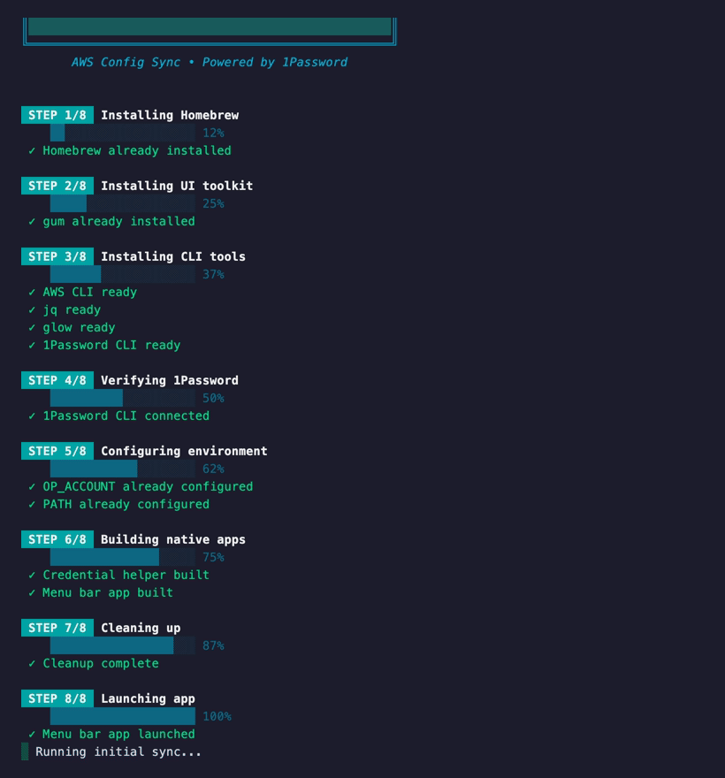

# NorthBuilt Config Sync

Configuration sync tools for NorthBuilt employee workstations. Native macOS menu bar apps that keep configurations up to date via 1Password integration.



## Available Tools

| Tool | Command | Status |
|------|---------|--------|
| [AWS](docs/aws/) | `curl -fsSL config.northbuilt.com/aws \| bash` | Ready |
| [SSH](docs/ssh/) | `curl -fsSL config.northbuilt.com/ssh \| bash` | Coming soon |

Or visit [config.northbuilt.com](https://config.northbuilt.com) to see all available setup scripts.

## Features

- **Native macOS Apps**: Menu bar apps built in Swift, compiled locally
- **Automatic Sync**: Configuration syncs daily at 8:00 AM Central
- **Self-Updating**: Apps check for updates and can update themselves from source
- **1Password Integration**: Credentials fetched securely on-demand
- **Network-Aware**: Skips sync when offline, resumes when connected
- **Notifications**: Alerts for sync failures and available updates
- **Launch at Login**: Optional automatic startup

## Prerequisites

All setup scripts require:

1. **1Password desktop app installed**
2. **1Password CLI integration enabled:**
   - Open 1Password → Settings → Developer
   - Enable "Integrate with 1Password CLI"
3. **Automation permission for 1Password** (one-time approval):
   - When you see "op would like to access data from other apps", click **Allow**
   - This grants permission to the sync app (`NorthBuilt Config Sync`) - the choice persists
   - If you clicked "Don't Allow", go to System Settings → Privacy & Security → Automation and enable the toggle for "1Password" under "NorthBuilt Config Sync"

## How It Works

Each tool follows the same pattern:

1. **Setup** — One-time install via curl command
   - Downloads Swift source files
   - Compiles natively on your machine
   - Creates menu bar app bundle
   - Launches and runs initial sync

2. **Sync** — Menu bar app syncs daily (or manually via menu)
   - Downloads latest config template
   - Substitutes values from 1Password
   - Deploys to appropriate location

3. **Updates** — App checks for updates every 6 hours
   - Notifies when update available
   - Downloads new source, compiles, restarts automatically
   - Maintains "compile from source" trust model

4. **Credentials** — Fetched from 1Password on demand
   - Never stored on disk
   - MFA codes retrieved automatically

## Repository Structure

```
docs/                           # Served via GitHub Pages at config.northbuilt.com
├── index.html                  # Landing page
├── CNAME                       # Custom domain config
├── config.json                 # Centralized branding configuration
└── [tool]/                     # Each tool has its own directory
    ├── README.md               # Tool-specific documentation
    ├── index.html              # Setup script (curl-able)
    ├── *.swift                 # Swift source files (compiled during setup)
    └── *.icns, *.png           # App and menu bar icons
```

## Security

See [SECURITY.md](SECURITY.md) for:

- Branch protection setup (required: 2+ approvers)
- Trust model and incident response
- Self-update security considerations

## For Administrators

See individual tool READMEs for administration guides:

- [AWS Configuration](docs/aws/README.md)
- [SSH Configuration](docs/ssh/README.md) *(coming soon)*

### Releasing Updates

1. Make changes to Swift source files
2. Commit with descriptive message (this becomes release notes)
   - Use `[minor]` or `[major]` tags in commit message for larger bumps
   - Normal commits trigger patch version bumps
3. Push to main (requires 2+ approvals)
4. GitHub Actions automatically creates a release with version tag
5. Users receive update notification within 6 hours
